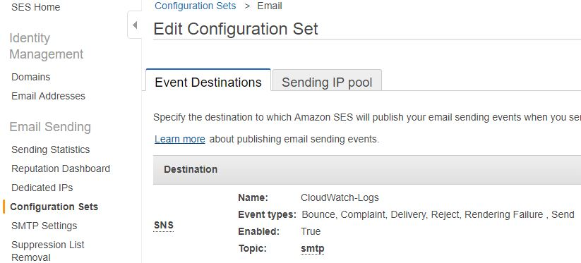
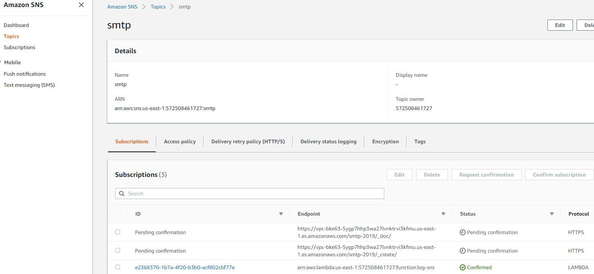
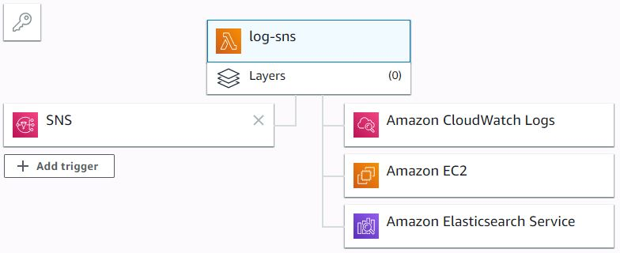

# lambda-ses-to-elastic
AWS Lambda trigger to pipe SES email logs to elastic.

This trigger was built because AWS does not provide the logs to the Simple Email Service (SES). Instead, the user can set up a "Configuration Set" to pipe events to an SNS topic, and have AWS Lambda subscribe to that.

## Usage
After getting the nodeJS code into Lambda, the following environment variables shoudl be set:

 - ELASTIC_HOST the hostname for the elastic instance, i.e. vpc-myelk-jhcjhjdhdjfhdjhf.us-east-1.es.amazonaws.com
 - ELASTIC_INDEX the name of the index to write to, i.e. logstash-2019
 - ELASTIC_TIMEOUT_MS the timeout for http calls to elastic, in milliseconds, i.e. 10000

## Assumptions

 - SSL/HTTPS port 443 (standard port)
 - POSTs to /{ELASTIC_INDEX}/_doc/
 - Errors are logged to console >> CloudWatch
 - Built on NodeJS 10.x
 - You may need to set your VPC

## Setup

### Simple Email Service - Configuration Set

### Simple Notification Service - Topic

### AWS Lambda - Trigger

